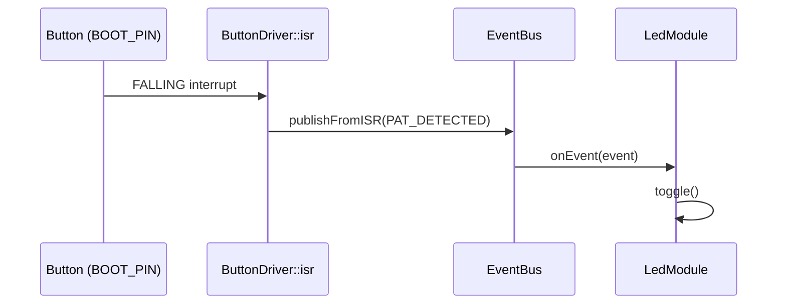
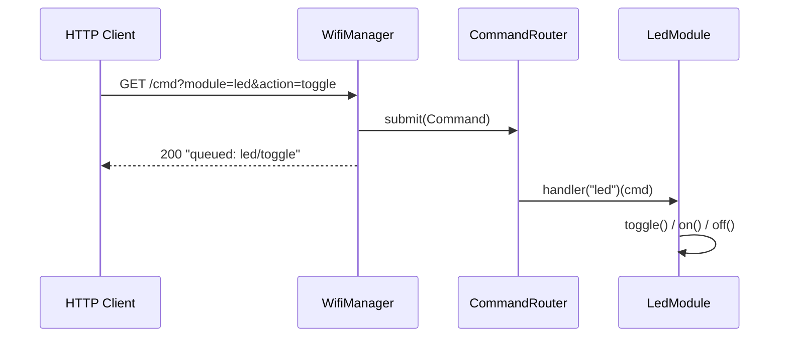
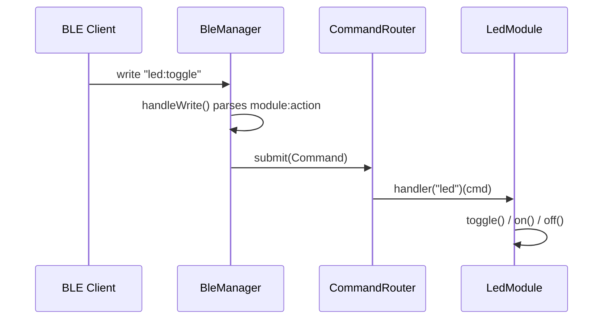
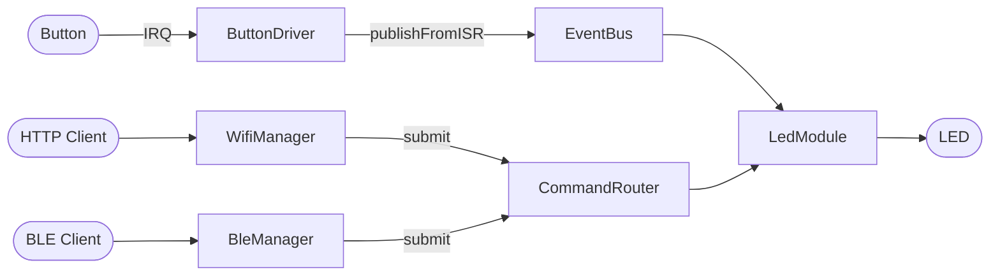

# Y-Bot


ESP32 firmware (PlatformIO, Arduino framework) that reacts to a physical
button press and to remote commands sent over WiFi or BLE, routing both
into shared modules such as the onboard LED.

## Features

### Physical interaction handling

A press on the BOOT button is captured by an ISR and published onto an
event bus, decoupling hardware input from module logic.



### WiFi command handling

An HTTP server accepts `GET /cmd?module=...&action=...` requests and
queues them as commands.



### BLE command handling

A BLE GATT characteristic accepts writes in `module:action` format and
queues them the same way as WiFi.



### System overview



## Project layout

- `src/app/` — `EventBus` (ISR-safe pub/sub) and `CommandRouter` (module command dispatch)
- `src/comms/wifi/` — `WifiManager`, HTTP command endpoint
- `src/comms/ble/` — `BleManager`, BLE GATT command endpoint
- `src/comms/protocol/` — shared `Command` definition
- `src/drivers/` — hardware input drivers (`ButtonDriver`)
- `src/modules/display/` — output modules (`LedModule`)
- `src/config/Pins.h` — pin assignments

## Build

```
pio run
pio run -t upload
pio device monitor
```
